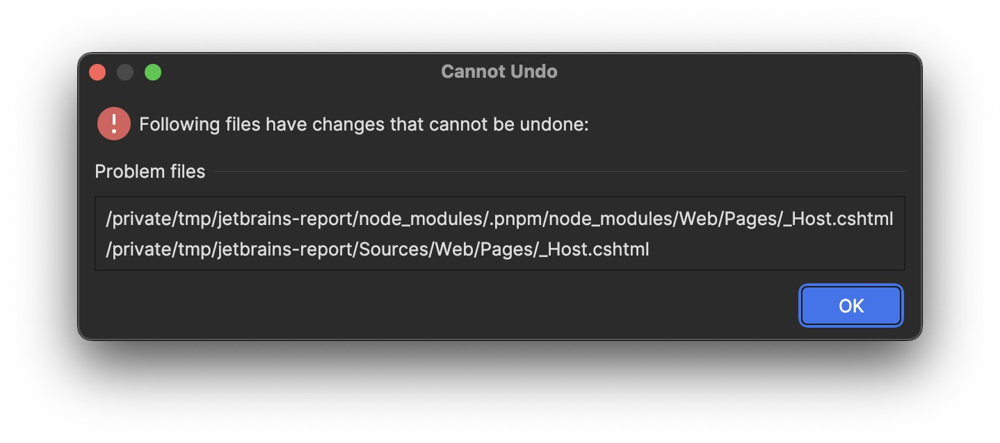

# JetBrains Report - Cannot undo having `node_modules`

## Screenshot



## Steps to reproduce

### 0. You can just clone this repo, skip steps 1, 2, and 3, and just install the dependencies

```shell
pnpm install
```

### 1. Setup the base project

```shell
mkdir jetbrains-report && cd jetbrains-report
dotnet new sln
dotnet new webapp -o Sources/Web
dotnet sln add Sources/Web
```

### 2. Setup pnpm workspaces

`pnpm-workspace.yaml`

```yaml
packages:
    - Sources/*
```

`package.json`

```json
{
    "name": "jetbrains report"
}
```

```shell
cd Sources/Web
pnpm init
```

### 3. Install some packages

```shell
cd Sources/Web
pnpm add bootstrap utopia-core-scss
```

### 4. Simulate normal changes

`Sources/Web/Pages/_Host.cshtml`

```diff
<link href="Web.styles.css" rel="stylesheet"/>
<link rel="icon" type="image/png" href="favicon.png"/>
+ <script src="js/bootstrap/bootstrap.min.js"></script>
<component type="typeof(HeadOutlet)" render-mode="ServerPrerendered"/
```

`Sources/Web/wwwroot/scss/core.scss`

```scss
@use "../../node_modules/utopia-core-scss/src/utopia";
```

#### 5. Link node_modules packages

```shell
cd Sources/Web/wwwroot/css
ln -s ../../node_modules/bootstrap/dist/css/ bootstrap
```

```shell
cd Sources/Web/wwwroot/js
ln -s ../../node_modules/bootstrap/dist/js/ bootstrap
```

#### 6. Save and reformat some files within the project

#### 7. After save/reformat the file, try undo it
